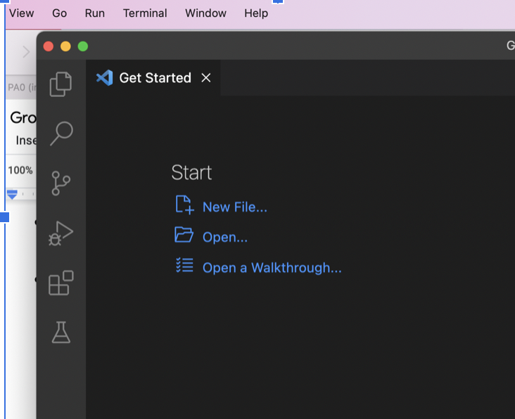
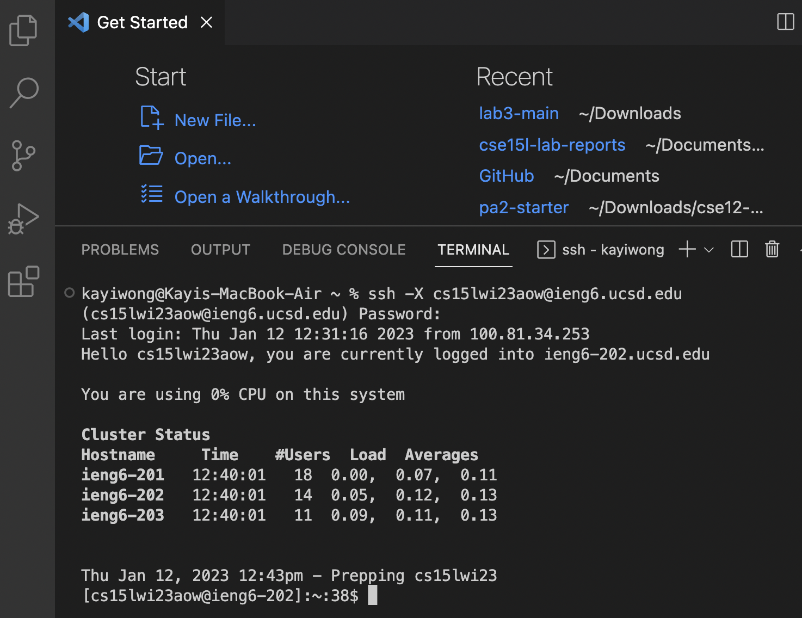
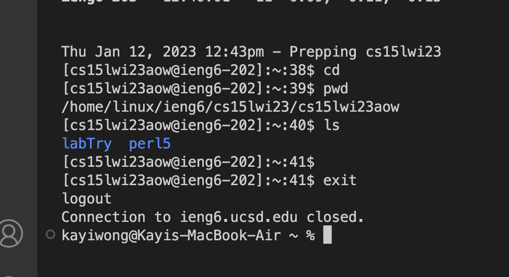
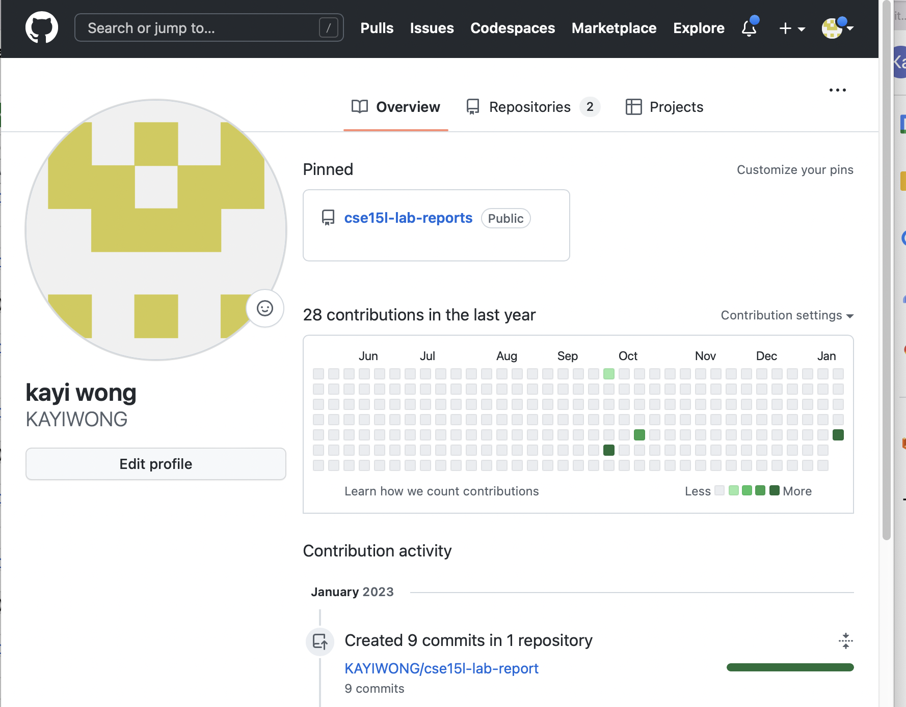

Hello new classmates! The following are some instructions about how to getting start! 
The First Step, Installing VScode (Work both Mac or Windows) ; Here is the link to Go to the Visual Studio Code website [Link](https://code.visualstudio.com) and follow the instructions to download and install it on your computer. 

The Second Step, try to Remotely Connecting to our UCSD Account. 
Here is an command we put on our terminal, $ ssh cs15lwi23aow@ieng6.ucsd.edu.
Login with your UCSD student account, mine: cs15lwi23aow  
Then login with your passwords. (If it is blank, you should still typing it)
It look like this: $ ssh cs15lwi23aow@ieng6.ucsd.edu

Third Step, After you successfully log in to your UCSD account, you can now try some commands. 
For example: cd // change directory; ls //list wheere directory is ; pwd // print working directory ; cat// <path1><path2> prints the contents of one files givens by the paths; Ctrl-D //log out of the remote server; Etc.

Extra Tips: The following is some tips for Github. (Question: How to create an account and how to upload pics!) First, go to [Link](https://github.com) and sign up for a new account. 

Second, try to create new files (filename.md) and write some text in them. 
The following is the link to some text formats.[Link](https://commonmark.org)
After you finish it, then just "Commit Changes", and you should be able to see your files! 

Tips about uploading pictures, you need to download your pic into your desktop, ex "pic1.png". Then go to your Github pages, click add files, and then upload the pic1.png to your GitHub files. Then, uses the text format uploaded above. For pics either "pic1.png or the whole link". Refresh your pages and go to Setting, then click "Pages" and copy your account link. Put your new files name and add "html" at the end of your links. Then, you should be able to see the pages of your new file. 

---END---

