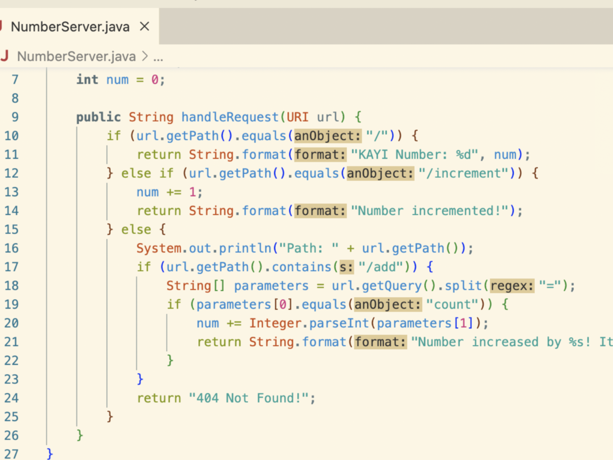
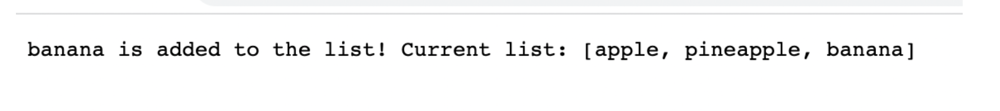
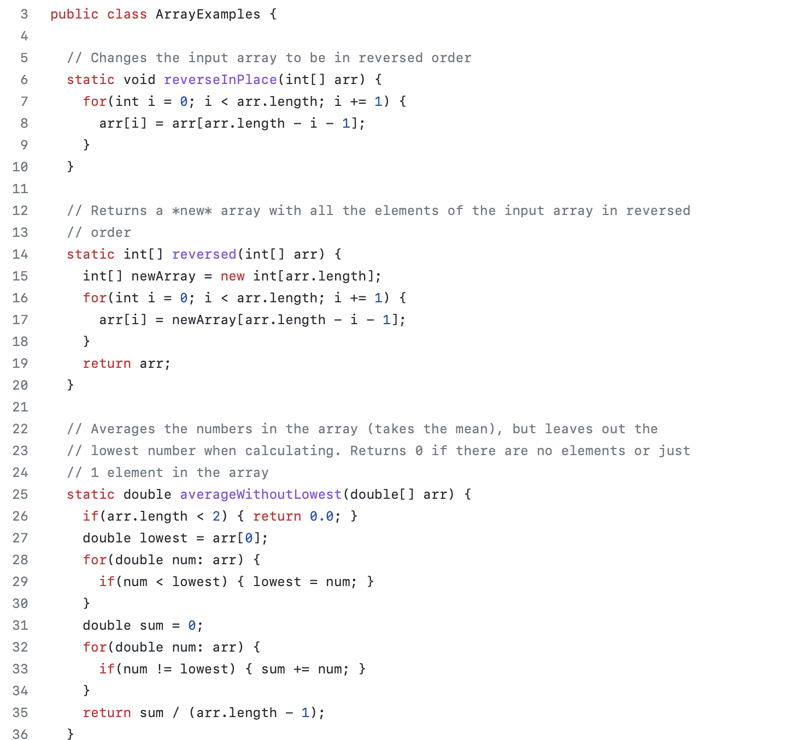
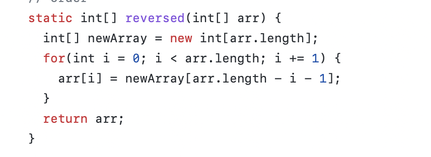
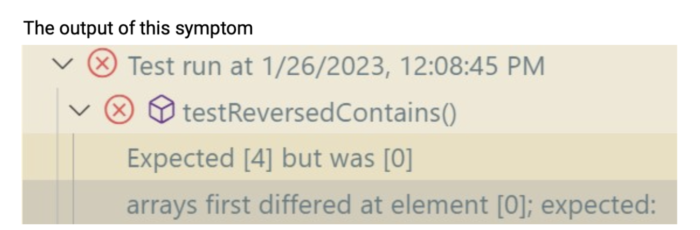
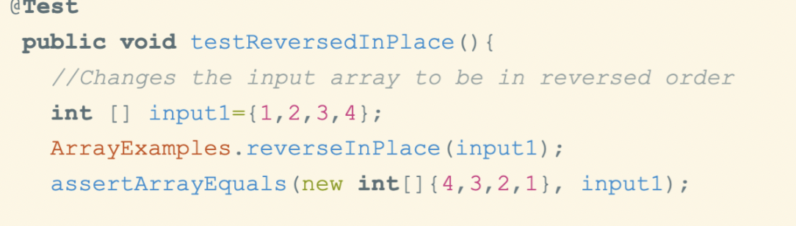

There are three part in this week's lab report. 
In part One, I will follow the instrustion and write a web server called StringServer. It include the code forStringServer, and two screenshots of using /add-message.

In part Two, I will choose One bugs from week 3 lab and provided some detailed information. 

In part Three, i will summarazied knowledge that I learned from week 2 and 3.

Let's get start in Part One!  First, I'm trying to use "add" method to add "banana" to the list. For "/add" in the path, 
if name[0]=s, then name[1] is being add to our arraylist. So the final output of our arraylist is "apple pineapple banana".Also, we're using "if" statement and result to keep updating our output value. 
The next pictures is a screenshot from Lab 2, which showing the Output. 

Next, we going to Part Two. The following picture is the code from "ArrayExamples.java". So in this code, we are going to reverse all the input elements and return a new array. 

This file has some tests for the methods in ArrayExamples.java, and usingh JUnit to run tests using methods called assertEquals and assertArrayEquals. The first bugs that I found is this code is only return the old array "arr",. 

How can we fix it? Instead of using "arr" to return the new array, we should assigning a newArray in this for loop. For example, arr[i]=newAarray[arr.length - i -1], arr[i] is equal to 0. In our group discussion, the orginal code only works correct for half the array, so we should use a new array instead and assign it to the old array after iterating. 

Last, we going to Part Three. Describe something I learned from lab in week 2 or 3. For me, a lot of knowledge learned in this class is new, especially the specific skills learned in the lab. Including how to use github smoothly, and how to find bugs in the code and modify and optimize.
